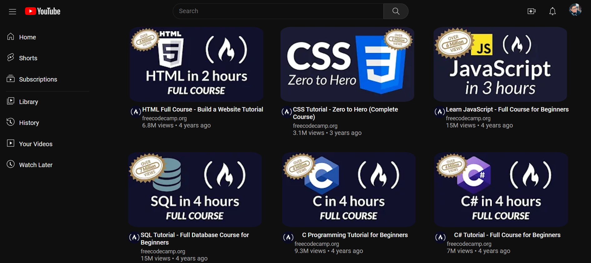

<h1 align="center">Clonagem da Página Inicial do Youtube CSS</h1>

<i>Projeto 3 do curso de CSS da Digital Innovation One, por meio do uso do CSS Grid, entre outras propriedades aprendidas no curso.</i>

<h3>Sobre o projeto</h3>

As tecnologias utilizadas na criação deste projeto são HTML e CSS, com o auxílio da IDE Visual Studio Code.

<h3>Resultados do projeto</h3>

