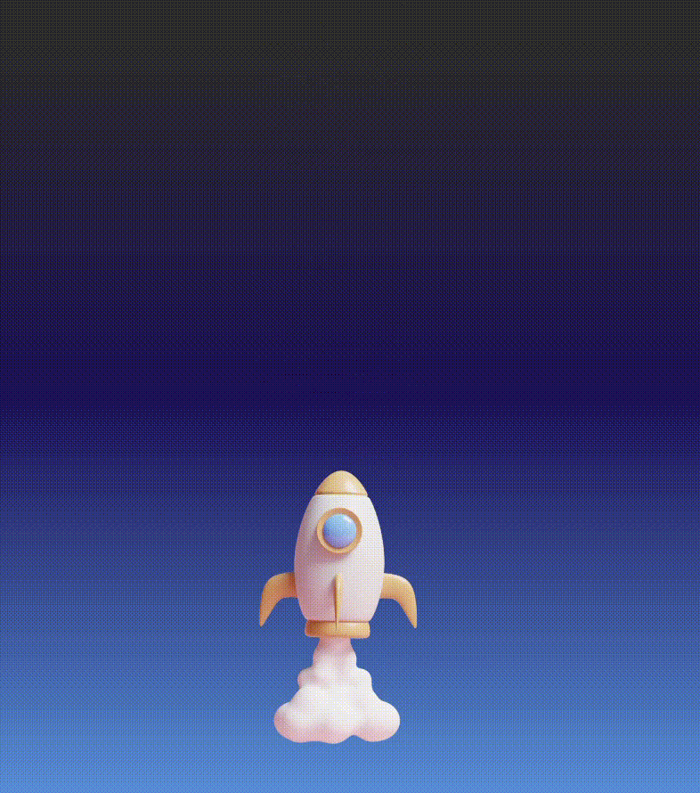

# DIO-CSS-Projeto-5
Criar animações com CSS é essencial para o desenvolvimento de sites, pois essas são de fácil utilização para animações simples.

Neste projeto, foram criados cinco exemplos práticos de como o CSS pode nos auxiliar nessa missão, sem a necessidade de linguagens de script.

### Exemplo 1 - Botão
Neste exemplo, um botão foi criado com animações de rotação, de forma a criar efeitos únicos de ilusão de ótica.

### Exemplo 2 - Loader
Neste exemplo, foi criada uma simulação de um efeito de carregamento, vastamente presente atualmente em milhões de páginas web, tornando-se portanto, indispensável a um site de qualidade.

### Exemplo 3 - Foguete
Com o emprego exclusivo de CSS, podemos criar inúmeros efeitos e animações. Uma delas, é o clássico foguete! No exemplo abaixo, foi feito o emprego de `@keyframes`, essenciais para o desenvolvimento de animações em CSS.

### Exemplo 4 - Gradient-word
Podemos também estilizar textos e cores de fundo com animações. Neste exemplo, há o emprego de animações para gradientes de cores de fundo.

